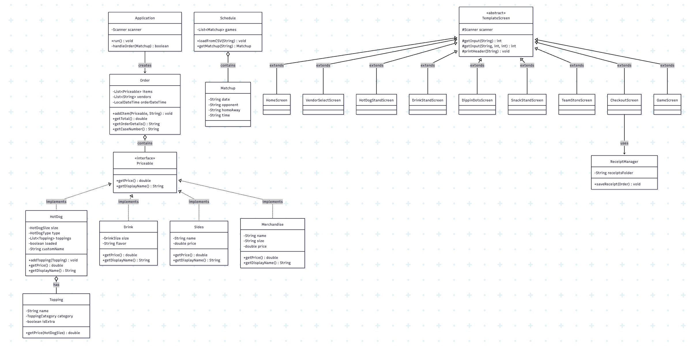
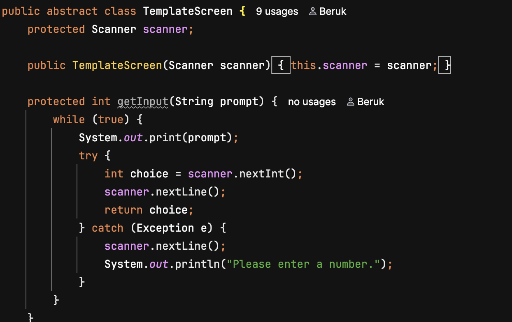

# T-Mobile Ballpark

A point-of-sale application themed around the T-Mobile Park ballpark experience for the Seattle Mariners 2026 season.

## How to Run

1. Clone the repo from GitHub
2. Open the project in IntelliJ IDEA
3. Make sure `mariners_schedule.csv` is in the project root directory
4. Make sure `playball.wav` and `stretch.wav` are in the project root directory
5. Run `FanExperience.java`
6. Make sure to type in an accurate date thats on Mariners 2026 season schedule! (Look it up if you have to)

## The Design Process

When I saw the capstone spec for a generic sandwich shop POS I knew I wanted to do something different. I wanted to capture the fan experience of being at a baseball game. Not just ordering food but the whole thing, walking through the gates, seeing your ticket, wandering the stadium, grabbing a Seattle Dog before the game, watching the Mariners play, hearing Take Me Out to the Ball Game at the 7th inning stretch, and checking your phone on the way home.

Through this project I learned about systematic design principles and really wanted to implement them because they made the most sense for what I was building. Every vendor is its own screen class but they all extend a shared TemplateScreen that handles input validation in one place. Every item in the ballpark, whether it's a hot dog or a jersey, implements the same Priceable interface so the Order class can treat them all the same way. The model classes handle data and pricing, the UI classes handle what the user sees, and the util classes handle file operations.

The hardest part was making the checkout flow feel realistic. The capstone spec wants a checkout screen with confirm and cancel. But at a real ballpark you pay at each stand, you don't carry a running tab. At first I thought of simulating a banking recent transactions screen, because the capstone requires you to reverse or cancel orders I came up with an even better idea of simulating one of those bank fraud texts you get when they verify it's you when a suspicious activity occurs. So the solution was a Chase Bank fraud alert concept. You swipe your card at each vendor as you go and the "checkout" is actually a text message from 72166 (the real Chase fraud text number) asking if you made those purchases. Confirm saves the receipt. Saying you got robbed triggers a whole investigation with Detective Sasha Iluku reviewing camera footage from every vendor you visited. Then if you admit it was you, the app roasts you based on your order.

Can you tell I had fun making this project?

## Class Diagram

## What I Learned

This was my first time using switch cases heavily in a project and they ended up being perfect for a menu-driven application like this. Every screen in the app uses switch cases to route user choices. Once I got the pattern down for the first vendor screen the rest came naturally because the structure was the same every time. Pick an option, switch on it, do the thing.

I also learned how powerful a simple interface can be. The Priceable interface is only two methods but it's the reason a Seattle Dog and a Ken Griffey Jr. jersey can sit in the same order and both know how to calculate their own price.

## Features

The app reads from a real 2026 Mariners schedule CSV. You enter the date you're visiting and if there's no game that day the ballpark is closed. If there is a game you get a ticket with the matchup and a barcode.

Inside the ballpark you visit vendor stands: Hot Dog Stand with full customization (size, type, premium meats, cheese, toppings, sauces, loaded option), signature dogs (Seattle Dog, Polish Dog), Drink Stand, Dippin' Dots, Snack Stand, and a Team Store where you can buy jerseys with real player names and numbers, hats, stickers with ASCII art, and a ball boy signed baseball (a callback to my first capstone on the accounting ledger).

Each purchase gets a card swipe confirmation. When you're done you can watch the game with a random score generator that pauses at the 7th inning stretch with Take Me Out to the Ball Game audio. If the game ties it goes to extra innings and the Mariners always win.

If you leave the ballpark early someone picks up your dropped credit card and puts a $67 charge on it. Receipts are saved to a receipts folder with timestamped filenames. There's also some easter eggs and inside jokes for the class, lets see if you can spot them.

## Interesting Code

The most interesting piece of code is TemplateScreen. It's an abstract class with two overloaded getInput() methods. The basic version just handles Scanner input. The validated version takes a min and max and loops until the user picks a valid option. Every screen in the app extends TemplateScreen and uses these methods instead of writing raw Scanner code. Before this change I had scanner.nextInt() and scanner.nextLine() written probably 30+ times across 9 screen classes. After the refactor each input is one line and every single one has validation built in.

This was a direct response to feedback from Gregor about incorporating more inheritance into my UI classes. It taught me that inheritance isn't just about sharing fields, it's about sharing behavior.

## User Experience Over Styling

For this capstone I really wanted to focus on the user experience. My first capstone was heavy on styling with ANSI colors and formatted headers on every screen. This time I put that energy into how the app feels to use instead. Every decision was about making it feel like you're actually at a baseball game, not just navigating menus.

That's why you enter a date before you see the ballpark, receive a ticket, ability to choose what to do once in the stadium, the 7th inning stretch, the simulated checkout fraud alert on your phone.

I honestly didn't fully get to style it the way I envisioned it. I had plans for ASCII art at every vendor, jersey displays when you pick a player, and team logos for the matchup screen (I can get carried away with my visions sometimes...) But I'm very happy with the experience of it!

I might make a version two of this where all of that gets implemented. ASCII art stadiums, jersey displays, team logos for every matchup, ANSI color theming across every screen, and eventually tying it into my accounting ledger capstone so each vendor reports its finances.

This was genuinely fun to build and didn't really feel like an assignment. I felt like I was actually building a mini simulation lol. 

Thank you! & Go M's!!
